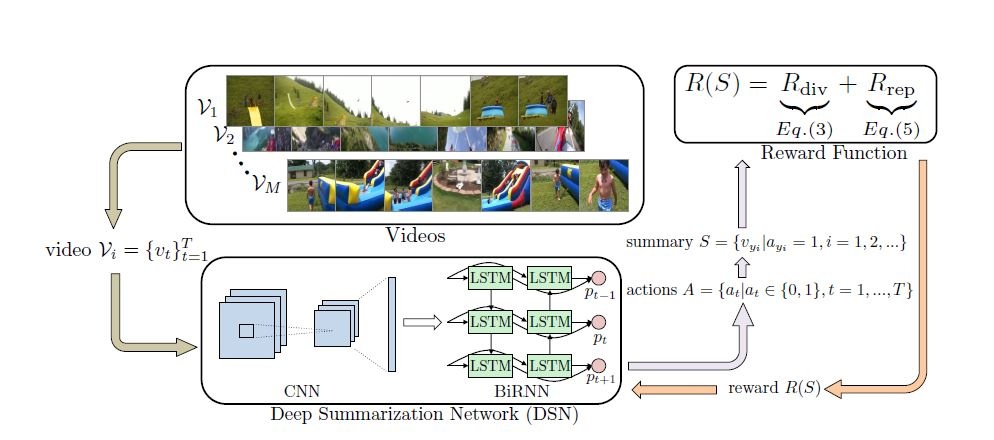

- On-line learning : 사람이 이미 레이블한 데이터에 기반한 머신러닝 모델의 성능을 알 수 있음 = 얼마나 많이 레이블링을 해야하나
- active learning : 레이블이 된 데이터와 되지 않은 데이터를 비교하여 성향이 다른 것을 고름 = 무슨 데이터를 레이블링 해야하나 

> http://geference.blogspot.com/2019/04/model-in-loop-ai-weak-supervision.html

## Deep Reinforcement Learning for Unsupervised Video Summerization with Diversity-Representativeness Reward

### Abstract

--------------------------------------------------------------------

* 우리는 이 논문에서 video summerization을 연속적인 의사결정 과정으로 표현하고, 영상 요약을 위해  **deep summarization network**(DSN) 를 만든다.
* 우리 방법은 비지도 뿐 아니라 지도학습 접근법에서도 잘 통한다

## Introduction

#### DPP-LSTM 

-  양방향 LSTM과 determinantal point process를 합친 것. 중요도와 output 특징 벡터를 output으로 뽑아냄.

-  비디오 축약에는 ground truth가 없기 때문에 더 효과적인 요악 방안이 요구됨. 

- 학습 프로세스에서, DPP-LSTM은 합성비디오가 진짜인지 아닌지 판별하기 위해 keyframe과 판별부 네트워크를 이용하고, 그것은 DPP-LSTm이 더 대표적인 프레임을 선별하도록 강제한다. 하지만 이런 학습 프레임워크는 트레이닝을 불안정적으로 만들고, 결국 모델을 붕괴시킨다. 

- 여러 단계의 학습이 필요하고, 실제로는 효율이 적다.

  

#### DSN(이 논문에서 만들고자 하는 것) 

- encoder-decoder구조이다.
- encoder부분은 feature extraction 역할을 하는 CNN이다.
- decoder 부분은 확률을 생성하는 양방향 LSTM이다.
- DSN을 학습시키기 위해서는, DR reward function을 사용하는 강화학습 프레임워크 기반 end-to-end방식을 제안한다.
- diversity-representativeness(DR) reward function은 생성된 요약의 다양성과 대표성을 공동으로 처리하며 label이나 사용자 상호작용에 전혀 의존하지 않는다.
- reward function은 diversity reward(다양성)과 representativeness reward(대표성)로 구성된다.
- diversity reward부분은 선택된 frame이 얼마다 유사하지 않은지 측정하고, representativeness부분은 frame과 선택된 것 중 그것과 가장 가까운 frame의 거리를 계산한다. 이 두 reward는 서로 보완한다.
- DSN학습을 위해 강화학습을 사용하는 것은 첫 번째로, RNN은 시간적인 스텝마다 시그널을 사용하는데, 우리의 reward는 전체 비디오 순서가 끝나야 얻을 수 있다. reward로부터 supervision을 제공하기 위해서는 시퀀스가 끝나야 가능하고, RL이 자연스러운 선택이 된다. (잘 모르겠음)
- 두번째로, RL은 필수적으로 action(frame을 고르는 것)을 최적화시키기 위해 노력함. - 그러나 action을 최적화시키는 매커니즘이 지도/비지도학습의 세팅에서 특별히 강조되지는 않음.
- 우리는 이러한 비지도학습 접근을 지도학습 접근으로 확장시킬 수 있다.

## Proposed Approach

- 강화학습을 통해 DSN을 훈련시킨다.
- DSN은 비디오 Vi를 받아서, 어떤 비디오 부분이 요약 S에 선택될지를 결정하는 액션A를 취한다.
- 피드백 reward R(S)는 요약 결과의 퀄리티(다양성과 대표성)에 의해 계산된다.

#### Deep Summarization Network

- DSN에는 encoder-decoder 구조를 채택함.
- encoder로는 비디오 프레임에서 특징을 추출하는 CNN을 채택했고, decoder로는 FC layer로 덮혀진 양방향 RNN을 채택했다.
- BiRNN이 전체적인 visual 특징을 input으로 받고, 해당하는 hidden state를 output으로 보낸다.
- FC layer는 sigmod function으로 끝나고, 각 프레임에 probability를 예측한다.

#### Diversity reward

- 우리는 요약된 것의 다양성 평가를 feature space에서의 비유사도로 측정한다.
- 사실, 프레임이 유사하더라도 시간적인 거리가 먼 경우에는 비디오 스토리라인 구조에 필수적이다. 이 문제 때문에,  시간적인 거리를 조절하는  λ를 도입하였다.

#### Representativeness reward

- 이 reward는 생성된 요약이 얼마나 비디오를 잘 대표하는지를 측정한다.
- 끝에, 우리는 비디오 요약의 대표성을 k-medoid로 계산한다.

