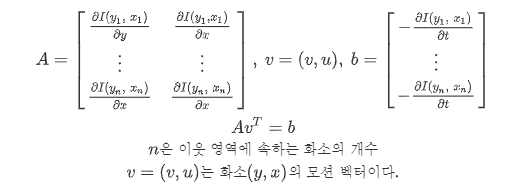

*'컴퓨터비전 - 오일석' 책 내용*

### 광류란?

- 인접한 두 장의 영상에 나타나는 명함 변화만 고려하는, 물체에 독립적인 영상 분석
- 개별 물체의 움직임을 명시적으로 반영하지는 않지만, 물체가 움직이면 그에 따른 명암 변화가 발생하는 것을 이용.

### 1. 광류 추정의 원리

**밝기 항상성** 가정을 세우고 모션 벡터를 구함.

밝기 항상성?

- 연속한 두 영상에 나타난 물체의 같은 점은, 명암값이 같거나 비슷하다는 점. 조명의 변화가 없어야 하고, 물체 표면과 광원이 이루는 각에 따라 변하는 명암 차이를 무시해야 함.
- 그럼에도 불구하고, 현실 세계에 적용했을 때에도 허용가능한 오차범위 내에서 동작.

인접한 두 영상의 시간 차이가 충분히 작다면, 테일러 급수에 따라 밑의 공식이 성립.

2차 이상의 항

2차 이상의 항은 무시하고, 밝기 항상성 가정을 따르면 dt동안 (dy, dx)만큼 움직여서 형성된 새로운 점의 명암은, 원래 점의 명암과 같다. 따라서 위의 식에서 함수 
$$
I(x+\Delta x,y+\Delta y,t+\Delta t) = I(x,y,t)
$$
가 된다.

이 상태에서 양변을 dt로 나누면
$$
\frac{\partial I}{\partial x}\frac{\Delta x}{\Delta t}+\frac{\partial I}{\partial y}\frac{\Delta y}{\Delta t}+\frac{\partial I}{\partial t}\frac{\Delta t}{\Delta t} = 0
$$
이 된다.

\\

$$
\frac{\Delta x}{\Delta t}는 \ t시간만큼의\ x의\ 변화량.\ 모션\ 벡터\ u이고 \\ \frac{\Delta y}{\Delta t}는\ t시간만큼의\ y의\ 변화량.\ 모션\ 벡터\ v이다.
$$

$$
\frac{\partial I}{\partial x}u+\frac{\partial I}{\partial y}v+\frac{\partial I}{\partial t} = 0 \qquad\qquad\qquad\qquad (10.6)
$$

이 식(10.6)을 광류 조건식(optical flow constraint equation) 혹은 그레디언트 조건식(gradient constraint equation)이라고 부른다.

이 식을 사용해도, 변수가 두 개이기 때문에 모션 벡터를 유일하게 구하지 못한다. 이때문에 가정을 추가하여 모션 벡터를 구한다.

### 2. 광류 추정 알고리즘

#### Lucas-Kanade 알고리즘

- 지역적 연산을 사용하는 지역적 방법 알고리즘이다.

- **화소 (y,x)를 중심으로 하는 윈도우 영역 N(y,x)의 광류는 같다고 가정**한다. = 이웃 영역에 속하는 모든 화소는 같은 모션 벡터를 가져야 한다.

- 이 가정에 위의 (10.6)식을 대입하면

  
  이 식을 v에 대해 정리하면 밑의 식이 된다.\\
  $$
  v^T = (A^TA)^{-1}A^Tb
  $$\\
  위의 행렬에 대입해서 풀면 모션 벡터 v를 얻을 수 있다.

  해당 식을 반복해서 계산해 벡터 v를 적용시키는데, v가 임계값보다 작으면 수렴했다고 간주하고 멈춘다.

- 중앙 화소에 가까울수록 큰 비중을 두는 식으로 바꾸면 보다 나은 품질의 모션 벡터를 구할 수 있다. 가중치 W로는 보통 가우시안을 사용한다.

- 벡터 v는 실수가 나오는데, 모든 화소의 좌표는 정수이므로 보간법을 적용해야 한다.

- 만약 어떤 물체의 표면에 명암 변화가 나타나지 않는다면 도함수 값은 0이 되고, 해당 영역의 광류가 0이 되는 문제가 있다.

- 이웃 영역을 결정하는 이웃의 개수(N)의 크기가 중요한데, 윈도우가 크면 큰 움직임까지 알아낼 수 있지만, 넓은 영역을 스무딩하게 되어 모션 벡터의 정확도가 떨어진다.

- bouguet은 입력 영상의 피라미드를 구한 후, 해상도가 가장 작은 영상에서 광류 정보를 계산하고 그것을 다른 영상으로 파급시키는 접근을 사용하였다. 움직임을 낮은 해상도에서 알아내서, 정확도도 유지하고 큰 움직임도 알아낸다.

- 정확도 측면에서는 뛰어나지만, 군데군데 광류값이 정해지지 않는 영역이 발생할 수 있다.

#### Horn-Schunck 알고리즘

- 전역적 알고리즘
- **광류는 부드러워야 한다는 가정**을 토대로 한다. = 광류는 균일하게 움직인다.
- 광류 맵의 부드러운 정도는 해당 식을 사용해 측정한다. 벡터를 y와 x방향으로 미분한 그레디언트이다. 그레디언트가 작다는 것은 이웃한 화소의 벡터가 비슷하다는 뜻(부드럽다)이다.

$$
||\Delta v||^2 + ||\Delta u ||^2 =\ (\frac{\partial v}{\partial y})^2 +  (\frac{\partial v}{\partial x})^2 +  (\frac{\partial u}{\partial y})^2 +  (\frac{\partial u}{\partial x})^2
$$

- 위의 식을 0에 가깝게 하는 동시에, (10.6)의 광류 조건식도 만족시켜야 한다.
- 이 알고리즘은 영상 전체에 대해 이들 값을 최소로 하는 해를 찾는 전략을 취한다.
- ![E=\iint \left[(I_{x}u+I_{y}v+I_{t})^{2}+\alpha ^{2}(\lVert \nabla u\rVert ^{2}+\lVert \nabla v\rVert ^{2})\right]{{{\rm {d}}}x{{\rm {d}}}y}](https://wikimedia.org/api/rest_v1/media/math/render/svg/2572893139a0a6f8d263970d1ae52a21c6fb97f1)

- 알파는 가중치이다. 알파를 크게 할수록 보다 부드러운 광류 맵을 얻는다.
- 마찬가지로 반복식을 이용하여 벡터를 구함.
- 반복하는 과정에서 명암 변화가 적은 영역에도 정보가 파급되므로, 모든 화소가 모션 벡터를 가지는 광류 맵을 생성해 준다.

#### 기타 알고리즘

- Bruhn은 위의 두 알고리즘의 장점을 결합한 추정 알고리즘을 제시함[Bruhn2005]

- 위의 알고리즘은 미분 기반 방법이지만 블록 매칭 방법, 에너지 방법 등등이 존재한다.

